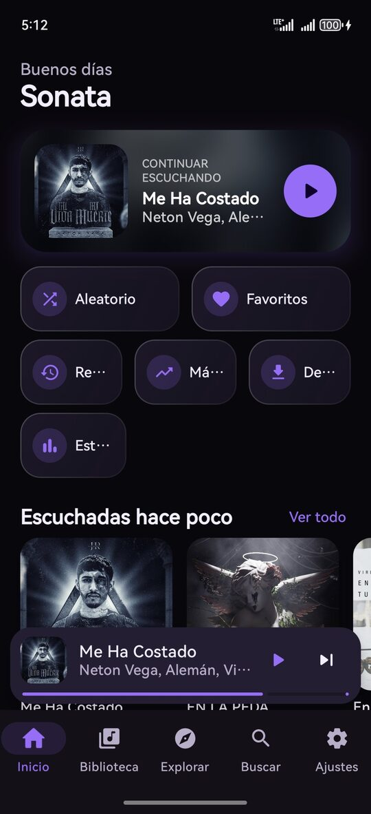
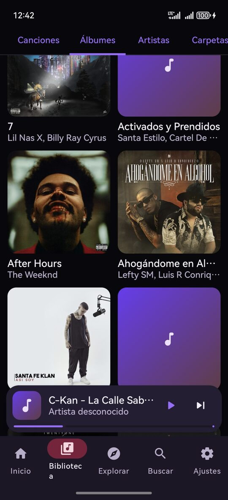
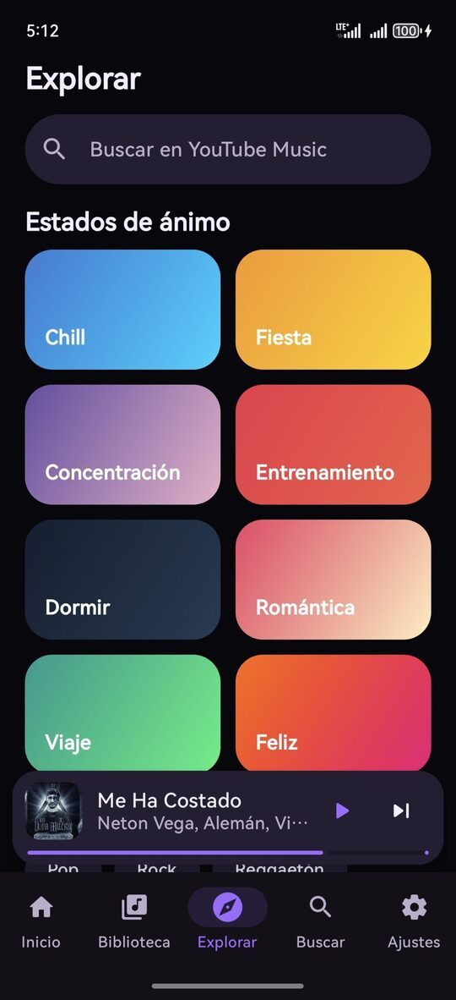
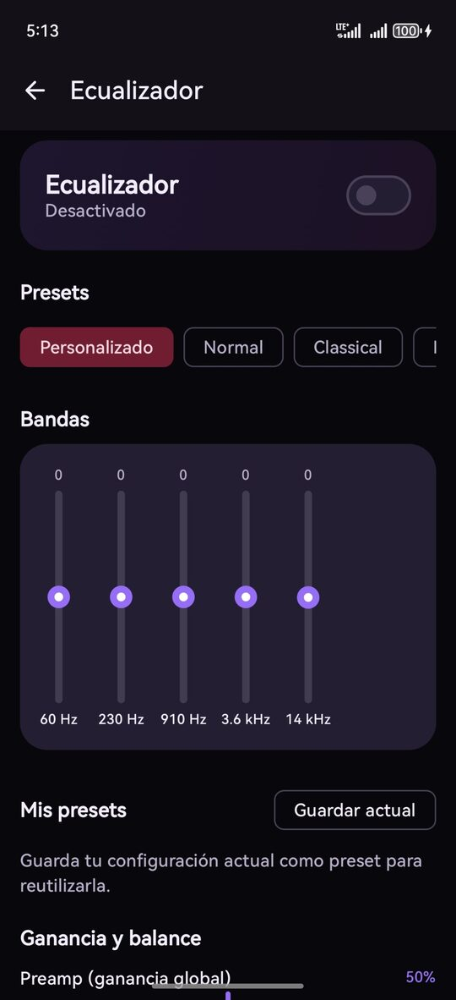
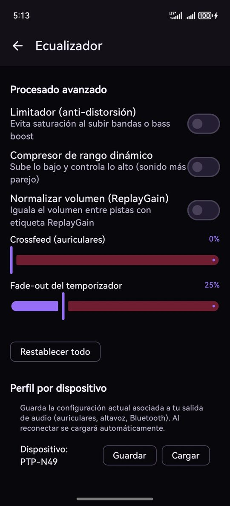
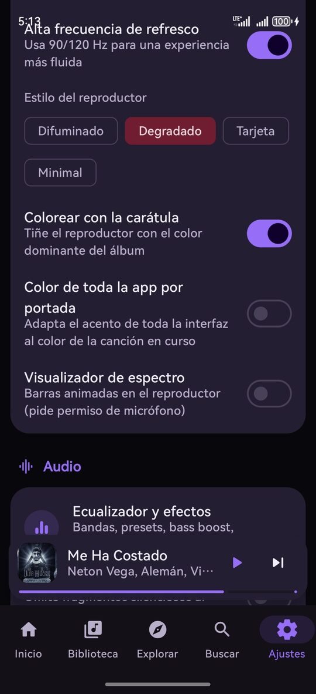
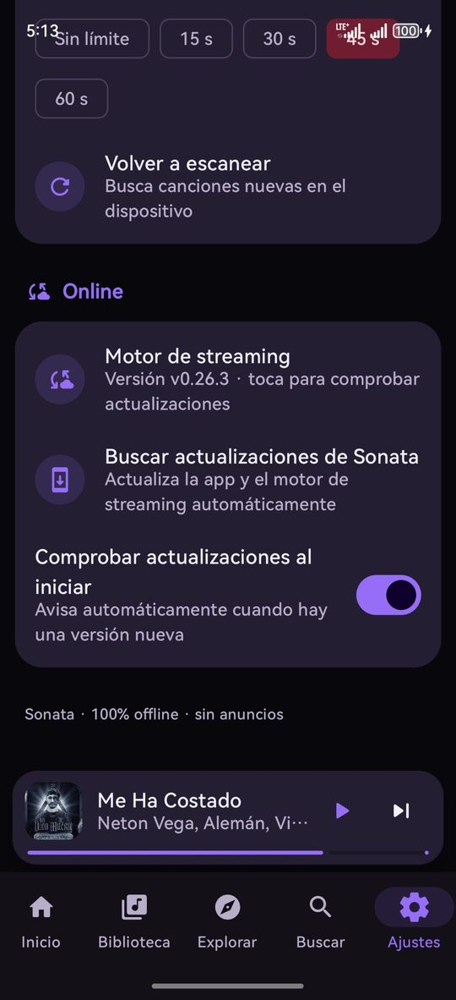

<div align="center">

# 🎵 Sonata

**Reproductor de música para Android — local y streaming, sin anuncios.**

Audio de máxima calidad · Ecualizador por bandas · Letras sincronizadas ·
Material You · Android Auto · Auto-actualización

[](https://github.com/tuangel134/sonata/releases)
[](https://github.com/tuangel134/sonata/releases)
[](https://github.com/tuangel134/sonata/releases)
[](https://github.com/tuangel134/sonata/releases)

[⬇️ Descargar APK](https://github.com/tuangel134/sonata/releases/latest) ·
[📋 Novedades](https://github.com/tuangel134/sonata/releases) ·
[💬 Reportar un problema](https://github.com/tuangel134/sonata/issues)

</div>

---

> **Sonata** es un reproductor de música para Android que combina la **utilidad y
> ligereza** de Musicolet con un **motor de audio potente** y una interfaz
> **Material 3** moderna. Funciona **100% offline** con tu biblioteca local y,
> si lo activas, también ofrece **streaming y descargas online** (YouTube Music).
> Sin anuncios, sin telemetría, sin cuentas.

## 📸 Capturas

<table>
<tr>
<td align="center"><b>Inicio</b><br><sub>Saludo + continuar escuchando</sub></td>
<td align="center"><b>Biblioteca</b><br><sub>Canciones, álbumes, artistas…</sub></td>
<td align="center"><b>Explorar</b><br><sub>YouTube Music + estados de ánimo</sub></td>
</tr>
<tr>
<td></td>
<td></td>
<td></td>
</tr>
<tr>
<td align="center"><b>Ecualizador</b><br><sub>Bandas + presets</sub></td>
<td align="center"><b>Procesado avanzado</b><br><sub>Limitador, compresor, ReplayGain</sub></td>
<td align="center"><b>Apariencia</b><br><sub>Temas y estilos del reproductor</sub></td>
</tr>
<tr>
<td></td>
<td></td>
<td></td>
</tr>
</table>

<div align="center"><sub>Online — motor de streaming y auto-actualización</sub></div>
<p align="center"></p>

## ✨ Características

### 🎧 Audio
- Reproducción de alta calidad con **Media3 / ExoPlayer** (FLAC, ALAC, WAV, OGG, Opus, MP3, AAC…).
- **Ecualizador** por bandas con presets (Rock, Pop, Jazz, Clásica, Bass Boost, Vocal…).
- **Bass Boost**, **Virtualizador**, **Loudness Enhancer** y **crossfeed**.
- **Gapless**, **skip-silence** y **crossfade** entre pistas.
- **Sleep timer** para dormir la reproducción.

### 📚 Biblioteca
- Organiza por **Canciones, Álbumes, Artistas, Carpetas y Listas**.
- **Colas múltiples** independientes (estilo Musicolet).
- **Favoritos** y **estadísticas** (más escuchadas, recientes, añadidas).
- **Playlists** propias: crear, añadir y reordenar.
- **Búsqueda global** instantánea.

### 🌐 Online (opcional)
- **Streaming y descargas** vía YouTube Music (motor NewPipeExtractor).
- **Letras online** desde LRCLIB.
- Se mantiene **actualizado solo**: el extractor se renueva con cada release.

### 🎤 Letras
- Letras **sincronizadas** `.lrc` (archivos locales, embebidas en los tags y online).
- Letra que avanza en tiempo real con la reproducción.

### 🎨 Interfaz
- **Material 3 / Material You** con **color dinámico** (Android 12+).
- **Now Playing** a pantalla completa con **4 estilos**: Difuminado, Degradado, Tarjeta y Minimal.
- **Tema teñido por la carátula** del álbum en reproducción (Palette).
- **Mini-player** deslizable que se expande al reproductor completo.
- Modos **claro / oscuro / negro AMOLED / seguir sistema**.
- **Visualizador de audio** opcional.

### 🚗 Integración del sistema
- **Android Auto** completo.
- **Control por voz** e intents del sistema (`MEDIA_PLAY_FROM_SEARCH`, búsqueda).
- **Deep links** propios (`sonata://…`).
- **Widget** de pantalla de inicio y **tile** de Ajustes rápidos.
- Notificación, pantalla de bloqueo y controles de auriculares.

### 🔄 Auto-actualización
- Sonata **comprueba las releases** de este repositorio al abrirse.
- Si hay una versión nueva, muestra un **diálogo con las notas** y un botón **Instalar**.
- El APK se descarga y se instala encima (misma firma) — sin perder datos.
- Puedes activar/desactivar la comprobación en **Ajustes → Online**.

## ⬇️ Descargar e instalar

1. Ve a la pestaña **[Releases](https://github.com/tuangel134/sonata/releases/latest)** y descarga el `app-release.apk` más reciente.
2. Instálalo. La primera vez, Android pedirá permitir **"Instalar apps desconocidas"** para Sonata.
3. ¡Listo! A partir de ahí, la app **se actualiza sola** cuando salen versiones nuevas.

> **Requisitos:** Android 7.0 (API 24) o superior.

## 🔒 Privacidad

- **Sin anuncios** y **sin telemetría**.
- El modo local funciona **sin permiso de internet**.
- El permiso de red solo se usa para el **modo online** (streaming/descargas/letras/actualizaciones) y es completamente opcional.
- Tus datos (favoritos, playlists, estadísticas, ajustes) se guardan **en tu dispositivo** con DataStore.

## 🛠️ Tecnología

| | |
|---|---|
| **Lenguaje** | Kotlin |
| **UI** | Jetpack Compose + Material 3 |
| **Audio** | Media3 (ExoPlayer + MediaSession) |
| **Streaming** | NewPipeExtractor (YouTube Music) |
| **Tags** | jAudiotagger |
| **Imágenes** | Coil + Palette |
| **Widgets** | Glance |
| **Persistencia** | DataStore |
| **Min SDK** | 24 (Android 7.0) |
| **Target SDK** | 35 (Android 15) |

## 🗺️ Roadmap

- [x] Biblioteca local completa + reproducción + ecualizador + letras
- [x] Streaming y descargas online (YouTube Music)
- [x] Now Playing con estilos y tema dinámico
- [x] Android Auto, widget, tile, control por voz
- [x] Auto-actualización vía GitHub Releases
- [ ] **EQ paramétrico** + AutoEQ con DSP propio (Oboe/NDK)
- [ ] Salida **bit-perfect / Hi-Res** a DAC USB
- [ ] Formatos exóticos (DSD, APE, TTA) vía FFmpeg
- [ ] Editor de etiquetas, marcadores y casting

## 📦 Sobre el código fuente

El **código fuente se mantiene en un repositorio privado**. En este repositorio
público se publican únicamente las **versiones (APK firmado)** y las notas de
cada release, para que cualquiera pueda descargar e instalar Sonata.

¿Encontraste un bug o tienes una sugerencia? Abre un
**[issue](https://github.com/tuangel134/sonata/issues)**.

---

## 💛 Apoya el proyecto

Si disfrutas Sonata y quieres ayudar a que siga mejorando, puedes apoyar con una donación:

**PayPal**
[`https://paypal.me/tuangel1346`](https://paypal.me/tuangel1346) · `tuangel1346@gmail.com`

**Criptomonedas (Bitcoin)**
```
bc1q5nrv64jchep3hpqptvwmume8rkw68937zftfpa
```

Tu apoyo ayuda a mantener el desarrollo, el servidor de releases y las futuras funciones audiófilas. ¡Gracias! 🙏

---

<div align="center">

Hecho con ❤️ por **Angel Collazo** · [GitHub @tuangel134](https://github.com/tuangel134)

<sub>⭐ Deja una estrella si te gusta el proyecto</sub>

</div>
